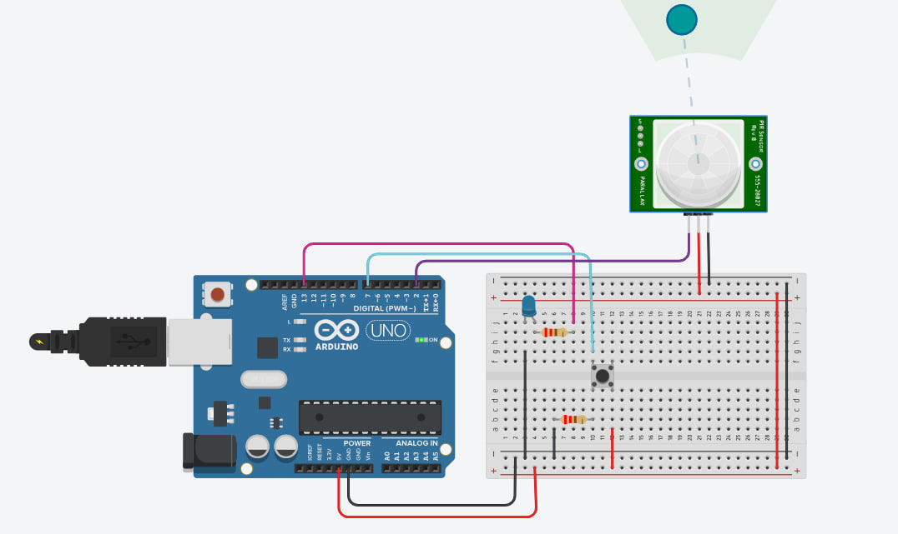

# 🔋 Smart Energy Saving System

This project simulates a smart electronic system designed to conserve battery power efficiently. Built with Arduino, it utilizes a motion sensor and a manual activation button to control an LED, demonstrating core concepts in low-power smart systems.


## 🔌 Circuit Overview

> 📸 *Circuit Schematic Preview:*  


---

## 📝 Description

This smart system works in the following steps:

1. ✅ Manual Activation: 
   - Pressing the push button activates the system.
   - The LED turns ON for a fixed duration of 7 seconds.

2. 🕵️ Motion Detection (via PIR Sensor):
   - If motion is detected, the LED remains ON continuously.

3. 🚫 No Motion Detected:
   - After motion stops, the LED will blink 3 times to indicate the end of monitoring.
   - Then the system automatically shuts down, saving battery power.

---

## ⚙️ Components Used

| Component           | Quantity |
|---------------------|----------|
| Arduino Uno         | 1        |
| PIR Motion Sensor   | 1        |
| Push Button         | 1        |
| LED                 | 1        |
| Resistor 330Ω       | 2        |
| Breadboard          | 1        |
| Jumper Wires        | As needed |

---

## 💻 Arduino Code

```cpp
const int pirPin = 2;
const int ledPin = 13;
const int buttonPin = 7;

bool systemOn = false;
unsigned long activationTime = 0;
unsigned long lastMotionTime = 0;
const unsigned long timeout = 7000;

void setup() {
  pinMode(pirPin, INPUT);
  pinMode(ledPin, OUTPUT);
  pinMode(buttonPin, INPUT);
}

void loop() {
  if (!systemOn && digitalRead(buttonPin) == HIGH) {
    systemOn = true;
    activationTime = millis();
    digitalWrite(ledPin, HIGH);
  }

  if (systemOn) {
    if (millis() - activationTime < timeout) {
      digitalWrite(ledPin, HIGH);
      return;
    }

    if (digitalRead(pirPin) == HIGH) {
      digitalWrite(ledPin, HIGH);
      lastMotionTime = millis();
    } else if (millis() - lastMotionTime > 5000) {
      for (int i = 0; i < 3; i++) {
        digitalWrite(ledPin, HIGH);
        delay(300);
        digitalWrite(ledPin, LOW);
        delay(300);
      }
      systemOn = false;
    }
  } else {
    digitalWrite(ledPin, LOW);
  }
}
