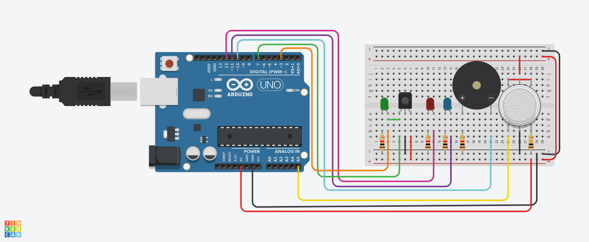

# 🔌 Electronics – Smart Energy Saving Circuits

This repository contains two Arduino-based circuits demonstrating smart energy-saving behavior and sensor-based control logic.

---

## 📦 Project Structure

# 1️⃣ [Motion-Controlled LED System]
A motion-activated LED system using a PIR sensor and manual activation button. The LED:

- Turns ON for 7 seconds upon pressing the button.
- Remains ON if motion is detected.
- Blinks 3 times and powers down when motion is no longer detected.

> ⚡ Purpose: Demonstrates intelligent power control using motion sensing.

📸 Circuit Preview  


## 💻 Arduino Code

```cpp
const int pirPin = 2;
const int ledPin = 13;
const int buttonPin = 7;

bool systemOn = false;
unsigned long activationTime = 0;
unsigned long lastMotionTime = 0;
const unsigned long timeout = 7000;

void setup() {
  pinMode(pirPin, INPUT);
  pinMode(ledPin, OUTPUT);
  pinMode(buttonPin, INPUT);
}

void loop() {
  if (!systemOn && digitalRead(buttonPin) == HIGH) {
    systemOn = true;
    activationTime = millis();
    digitalWrite(ledPin, HIGH);
  }

  if (systemOn) {
    if (millis() - activationTime < timeout) {
      digitalWrite(ledPin, HIGH);
      return;
    }

    if (digitalRead(pirPin) == HIGH) {
      digitalWrite(ledPin, HIGH);
      lastMotionTime = millis();
    } else if (millis() - lastMotionTime > 5000) {
      for (int i = 0; i < 3; i++) {
        digitalWrite(ledPin, HIGH);
        delay(300);
        digitalWrite(ledPin, LOW);
        delay(300);
      }
      systemOn = false;
    }
  } else {
    digitalWrite(ledPin, LOW);
  }
}
```
---

## 2️⃣ [Analog and Digital Sensors Simulation]
This task compares how analog and digital sensors behave in response to stimuli. Each sensor controls an LED to demonstrate:

- Analog sensor behavior (e.g., variable light intensity or range detection).
- Digital sensor behavior (simple ON/OFF threshold logic).

> 🔍 Purpose: Understand how Arduino reads and differentiates between analog and digital signals.
📸 Circuit Preview  

---

## 💻 Arduino Code

```cpp
int redLed = 12;
int greenLed = 11;
int buzzer = 10;
int smokeA0 = A5;
int irSensor = 7;
int irLed = 9;

int sensorThres = 500;

void setup() {
  pinMode(redLed, OUTPUT);
  pinMode(greenLed, OUTPUT);
  pinMode(buzzer, OUTPUT);
  pinMode(irLed, OUTPUT);
  
  pinMode(smokeA0, INPUT);
  pinMode(irSensor, INPUT);

  Serial.begin(9600);
}

void loop() {
  int gasValue = analogRead(smokeA0);
  Serial.print("Gas Sensor: ");
  Serial.println(gasValue);

  if (gasValue > sensorThres) {
    digitalWrite(redLed, HIGH);
    digitalWrite(greenLed, LOW);
    tone(buzzer, 1000, 200);
  } else {
    digitalWrite(redLed, LOW);
    digitalWrite(greenLed, HIGH);
    noTone(buzzer);
  }

  int irState = digitalRead(irSensor);
  if (irState == LOW) {
    digitalWrite(irLed, HIGH);
  } else {
    digitalWrite(irLed, LOW);
  }

  delay(100);
}
