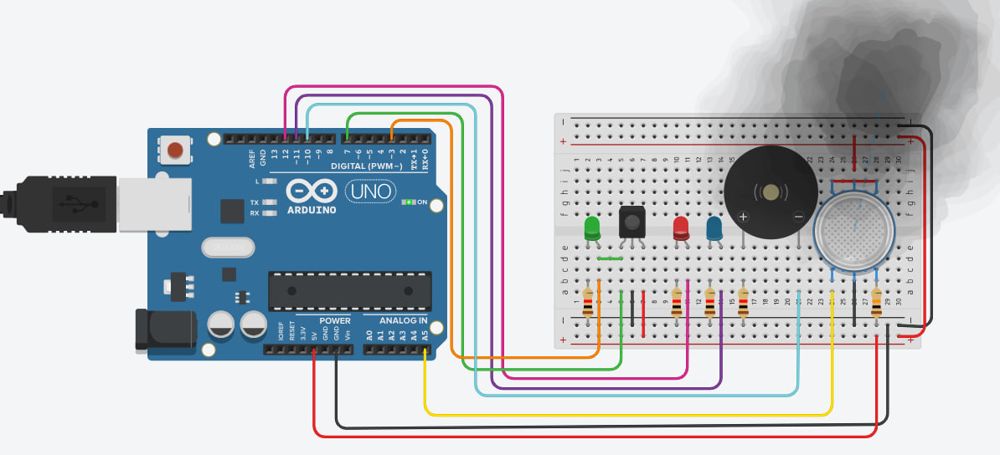

# Analog and Digital Sensors 



## 📌 Description

This project demonstrates a dual-sensor Arduino circuit using:

- MQ-2 gas sensor to detect harmful gas.
- IR sensor to detect object presence.

The circuit reacts with different colored LEDs and a buzzer depending on the readings. It simulates a real-world monitoring system using both analog and digital sensors.

---

## ⚙️ Components Used

| Component            | Description                        |
|----------------------|------------------------------------|
| Arduino Uno          | Microcontroller board              |
| MQ-2 Gas Sensor      | Detects flammable gas levels       |
| IR Obstacle Sensor   | Detects nearby objects             |
| Red LED              | Turns ON when gas is detected      |
| Blue LED             | Turns ON when no gas is present    |
| Green LED            | Indicates IR object detection      |
| Buzzer               | Audible alert for gas detection    |
| Resistors (1KΩ)      | Used with LEDs                     |
| Breadboard           | For circuit prototyping            |
| Jumper wires         | For connections                    |
---

## ⚙️ Behavior Summary

- MQ-2 sensor (Analog input A5):  
  - Gas detected → Red LED ON, Blue OFF, buzzer ON  
  - No gas → Blue LED ON, Red OFF, buzzer OFF

- IR sensor (Digital pin 7):  
  - Object detected → Green LED ON  
  - No object → Green LED OFF

---

## 📂 Project Files

| File Name         | Description                             |
|-------------------|-----------------------------------------|
| analogdigitalsensors1.ino | Arduino sketch with both sensors        |
| circuit_sensors.png | Screenshot from Tinkercad simulation |

---

## 🧠 Code

```cpp
int redLed = 12;
int greenLed = 11;
int buzzer = 10;
int smokeA0 = A5;
int irSensor = 7;
int irLed = 9;

int sensorThres = 500;

void setup() {
  pinMode(redLed, OUTPUT);
  pinMode(greenLed, OUTPUT);
  pinMode(buzzer, OUTPUT);
  pinMode(irLed, OUTPUT);
  
  pinMode(smokeA0, INPUT);
  pinMode(irSensor, INPUT);

  Serial.begin(9600);
}

void loop() {
  int gasValue = analogRead(smokeA0);
  Serial.print("Gas Sensor: ");
  Serial.println(gasValue);

  if (gasValue > sensorThres) {
    digitalWrite(redLed, HIGH);
    digitalWrite(greenLed, LOW);
    tone(buzzer, 1000, 200);
  } else {
    digitalWrite(redLed, LOW);
    digitalWrite(greenLed, HIGH);
    noTone(buzzer);
  }

  int irState = digitalRead(irSensor);
  if (irState == LOW) {
    digitalWrite(irLed, HIGH);
  } else {
    digitalWrite(irLed, LOW);
  }

  delay(100);
}
